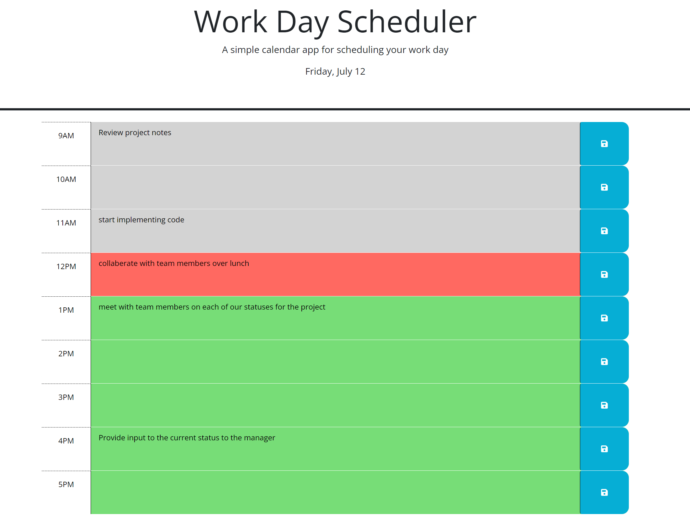

# Work_Day_Scheduler

## Description

WorkDay Scheduler uses DayJs to manipulate time and format dates as a third party API. The application uses dynamic HTML, local storage, and a timeslots array to enter descriptions in specified timeslots for a daily planner. Time slots are color coded, depending on an elements class for the hour. When the save button is pressed in a given timeslot, the time and description are pushed to the timeslot array and stored to local storage. DayJS is used for the current time and to format the date in the title for the current weekday and day of the month.

## Installation

N/A

## Usage

The current day is displayed at the top of the calendar. Timeblocks are displayed from 9AM to 5PM. Timeblocks are color coded depending on whether the time is past, current, or future. Events can be entered when clicking on a timeblock. The text for an event is stored to local storage when the save button is clicked. The saved events persist upon a refresh of the page.

GitHub Repository: https://github.com/rethomas67/Work_Day_Scheduler
GitHub page link: https://rethomas67.github.io/Coding_Quiz_Challenge/
